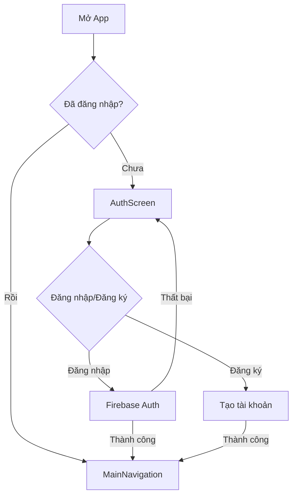
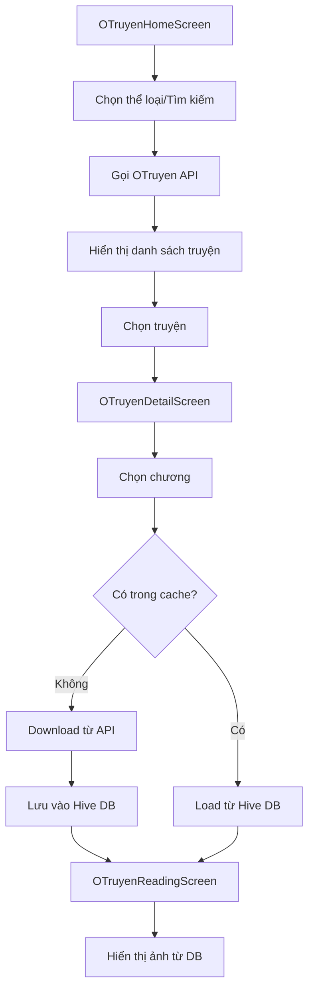
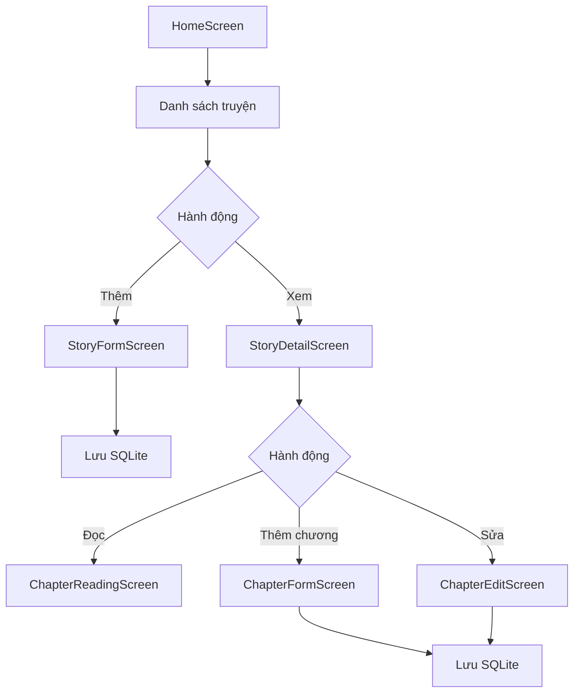

# Cấu trúc dự án Ứng dụng Đọc Truyện

## Tổng quan
Ứng dụng đọc truyện Flutter với 2 nguồn dữ liệu:
- **Truyện cục bộ**: Người dùng tự tạo và quản lý (SQLite)
- **Truyện Online**: Đọc từ OTruyen API (hỗ trợ offline với Hive cache)

## Kiến trúc MVVM

```
┌───────────────────────────────────────────────────────────────────┐
│                         VIEWS (UI)                                │
│  ┌─────────────┐ ┌─────────────┐ ┌─────────────┐ ┌──────────────┐ │
│  │ AuthScreen  │ │ HomeScreen  │ │OTruyenScreen│ │ProfileScreen │ │
│  └─────────────┘ └─────────────┘ └─────────────┘ └──────────────┘ │
└───────────────────────────────────────────────────────────────────┘
                              │
                              ▼
┌───────────────────────────────────────────────────────────────────┐
│                      VIEWMODELS (Logic)                           │
│  ┌─────────────┐ ┌─────────────┐ ┌─────────────┐                  │
│  │AuthProvider │ │StoryProvider│ │ThemeProvider│                  │
│  └─────────────┘ └─────────────┘ └─────────────┘                  │
└───────────────────────────────────────────────────────────────────┘
                              │
                              ▼
┌───────────────────────────────────────────────────────────────────┐
│                      SERVICES (Data)                              │
│  ┌───────────────┐ ┌─────────────────┐ ┌─────────────────────┐    │
│  │DatabaseHelper │ │OTruyenApiService│ │ImageDatabaseService │    │
│  │   (SQLite)    │ │    (HTTP)       │ │     (Hive)          │    │
│  └───────────────┘ └─────────────────┘ └─────────────────────┘    │
└───────────────────────────────────────────────────────────────────┘
                              │
                              ▼
┌───────────────────────────────────────────────────────────────────┐
│                       MODELS (Data)                               │
│  ┌───────┐ ┌─────────┐ ┌───────────────────┐ ┌───────────────┐    │
│  │ Story │ │ Chapter │ │OTruyenStoryDetail │ │ReadingHistory │    │
│  └───────┘ └─────────┘ └───────────────────┘ └───────────────┘    │
└───────────────────────────────────────────────────────────────────┘
```

---

## Cấu trúc thư mục

```
lib/
├── main.dart                           # file chính, khởi tạo Firebase & Hive
├── firebase_options.dart               # Cấu hình Firebase
│
├── models/                      # Dữ liệu Models
│   ├── story.dart                      # Model truyện cục bộ
│   ├── chapter.dart                    # Model chương truyện
│   ├── comment.dart                    # Model bình luận
│   ├── reading_history.dart            # Model lịch sử đọc
│   └── otruyen_models.dart             # Models cho OTruyen API
│
├── services/                    # Logic nghiệp vụ & API
│   ├── database_helper.dart            # SQLite database cho truyện cục bộ
│   ├── firebase_service.dart           # Firebase authentication
│   ├── otruyen_api_service.dart        # HTTP client cho OTruyen API
│   └── image_database_service.dart     # Hive cache cho ảnh offline
│
├── viewmodels/                  # Quản lý trạng thái (Provider)
│   ├── auth_provider.dart              # Quản lý đăng nhập/đăng xuất
│   ├── story_provider.dart             # Quản lý danh sách truyện
│   └── theme_provider.dart             # Quản lý chế độ sáng/tối
│
└── views/                       # Màn hình hiển thị
    ├── auth_screen.dart                # Màn hình đăng nhập/đăng ký
    ├── main_navigation.dart            # Bottom navigation
    ├── home_screen.dart                # Trang chủ truyện cục bộ
    ├── story_detail_screen.dart        # Chi tiết truyện cục bộ
    ├── story_form_screen.dart          # Thêm/sửa truyện
    ├── chapter_form_screen.dart        # Thêm chương
    ├── chapter_edit_screen.dart        # Sửa chương
    ├── chapter_reading_screen.dart     # Đọc chương text
    ├── my_stories_screen.dart          # Truyện của tôi
    ├── reading_history_screen.dart     # Lịch sử đọc
    ├── profile_screen.dart             # Hồ sơ & cài đặt
    ├── otruyen_home_screen.dart        # Trang chủ truyện online
    ├── otruyen_detail_screen.dart      # Chi tiết truyện online
    └── otruyen_reading_screen.dart     # Đọc truyện tranh online
```

---

## Sơ đồ luồng hoạt động

### 1. Luồng xác thực (Authentication)



### 2. Luồng đọc truyện Online (OTruyen)



### 3. Luồng quản lý truyện cục bộ



---

## Công nghệ sử dụng

| Công nghệ | Mục đích |
|-----------|----------|
| **Flutter** | Framework UI đa nền tảng |
| **Firebase Auth** | Xác thực người dùng |
| **Provider** | State management |
| **SQLite** | Lưu trữ truyện cục bộ |
| **Hive** | Cache ảnh và nội dung offline |
| **HTTP** | Gọi OTruyen API |
| **SharedPreferences** | Lưu cài đặt (theme, font size) |

---

## Tính năng chính

1. **Đăng nhập/Đăng ký** - Firebase Authentication
2. **Truyện cục bộ** - Tạo, đọc, sửa, xóa truyện và chương
3. **Truyện Online** - Đọc truyện từ OTruyen API
4. **Đọc Offline** - Cache ảnh và nội dung vào Hive database
5. **Lịch sử đọc** - Theo dõi tiến độ đọc
6. **Yêu thích** - Đánh dấu truyện yêu thích
7. **Chế độ tối** - Light/Dark mode
8. **Responsive** - Hỗ trợ mobile và web
